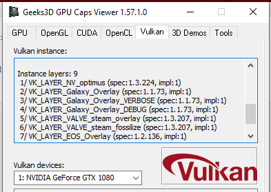

**Red Dead Redemption 2 (PC) - Won't start fix 2024**
--------------------

I suddenly encountered an error where my Red Dead Redemption 2 installation wouldn't work anymore. RDR2 just wouldn't start anymore, no loading screen or error message, nothing. 
Right after clicking "PLAY" on the Rockstar launcher, the game (rdr2.exe) opens for a second and then closes immediately, with no error message shown, and none in the error log files (very helpful, thanks Rockstar).

I tried deleting settings or profile, uninstalling the launcher, removing all files, moving the installation, and even a complete reinstallation, driver updates everything. Many people on reddit / google had this problem.

The issue is that the VULKAN API doesn't work anymore, and if you delete the profile or reinstall, it defaults to the Vulkan API.

Thanks to diceman2037 on reddit for the tips solving this issue.

----

**In the end, you have to remove old Vulkan Layers with regedit.exe**

For me, it was an old Twitch Layer that I installed years ago, and the uninstallation routine of Twitch didn't remove it.

Even if you believe you don't have such layers, check them out! It's not just Twitch; it can be any software that uses Vulkan Layers. This issue is predominantly associated with recording or video editing software, such as EOS/Epic Store Software, Bandicam, Reshade, OBS, RTSS, and so on.

**Instructions:**
--------------------
You can see your Vulkan Layers with GPU Caps Viewer [Download GPU Caps Viewer](https://www.techspot.com/downloads/4618-gpu-caps-viewer.html) 

Screenshot:




My old Vulkan layer was:

    5/ VK_LAYER_Twitch_Overlay (spec:1.1.0, impl:1)

As you can see, version 1.1.0 appears incompatible with the newer Vulkan drivers that come with the latest Nvidia drivers. RDR2 will just shutdown.
This incompatibility is why reverting to older versions of Vulkan/Nvidia has proven effective (for additional context and background information, refer to old Reddit threads linked at the end of this page).

---
**These old layers are the problem; you have to remove the old Vulkan Layers with Regedit.exe**

You can find the keys with these names/paths:

    HKEY_LOCAL_MACHINE\SOFTWARE\Khronos\Vulkan\ImplicitLayers
    HKEY_LOCAL_MACHINE\SOFTWARE\Wow6432Node\Khronos\Vulkan\ImplicitLayers
    HKEY_CURRENT_USER\SOFTWARE\Khronos\Vulkan\ImplicitLayers

These were my Twitch Layers:

    C:\Program Files\Common Files\Twitch\Studio\Versions\0.90.7641.33738\TwitchOverlayVulkanConfig64.json
    C:\Program Files\Common Files\Twitch\Studio\Versions\0.90.7641.33738\TwitchOverlayVulkanConfig32.json

After I removed them, the GPU Caps Viewer showed this:

    Instance layers: 9
     1/ VK_LAYER_NV_optimus (spec:1.3.224, impl:1)
     2/ VK_LAYER_Galaxy_Overlay (spec:1.1.73, impl:1)
     3/ VK_LAYER_Galaxy_Overlay_VERBOSE (spec:1.1.73, impl:1)
     4/ VK_LAYER_Galaxy_Overlay_DEBUG (spec:1.1.73, impl:1)
     5/ VK_LAYER_VALVE_steam_overlay (spec:1.3.207, impl:1)
     6/ VK_LAYER_VALVE_steam_fossilize (spec:1.3.207, impl:1)
     7/ VK_LAYER_EOS_Overlay (spec:1.2.136, impl:1)
     8/ VK_LAYER_EOS_Overlay (spec:1.2.136, impl:1)
     9/ VK_LAYER_ROCKSTAR_GAMES_social_club (spec:1.0.70, impl:1)

**So Twitch's Layer is gone, and Red Dead Redemption 2 starts. Hurray!**

If you want a detailed insight into this solution and how I uncovered the cause of the Vulkan Layer error, please read the following thread on Reddit:
[Vulkan Layer detailed testing](https://old.reddit.com/r/PCRedDead/comments/ykenv9/psa_if_red_dead_redemption_2_crashes_instantly/j0yml6k/)

**Quick Fix for Those Who Prefer an Easier Solution: Switching to DX12**
--------------------
If you're looking for a simple fix and prefer avoiding technical steps or Regedit, switching to DX12 is an easy alternative. 
Note that it might lead to slightly lower performance, but adjusting a setting in a specific file will do the trick:

```
YOUR_DOCUMENTS_FOLDER_NOT_THE_GAME_INSTALL\Rockstar Games\Red Dead Redemption 2\Settings\system.xml
```

Change

```xml
<API>kSettingAPI_Vulkan</API>
```

to

```xml
<API>kSettingAPI_DX12</API>
```

And don't forget to save the file. Red Dead Redemption will now start with DX12.

Switching to DX12 means RDR2 won't have problems with Vulkan Layers anymore, so it should start without issues. 

This solution is effective only if you've managed to launch the game at least once. Without an initial launch, no XML files are created, necessitating a return to using the Vulkan Layer Fix.

If using regedit.exe makes you uncomfortable, you can also use the Vulkan SDK to remove the Layers.

Happy Gaming, it's a brilliant game!

	
--------------------
**Archive / Informations:**

If you're interested in discovering how I found these solutions, here are some of my Reddit threads:

[old "RDR2 won't start"-Fix on Reddit, invoves deleting Files and reinstalling Vulkan (don't do it in 2024, Link is just an archive)](https://old.reddit.com/r/PCRedDead/comments/ykenv9/psa_if_red_dead_redemption_2_crashes_instantly/ixv8dv4/)

*This fix worked, but isn't really the right solution, after getting tips from /u/diceman2037 the cause of the problem are old / deprecated Vulkan Layers.*

[Reddit Red Dead Redemption 2 won't start Fix 2024 - basically this Page](https://old.reddit.com/r/PCRedDead/comments/ykenv9/psa_if_red_dead_redemption_2_crashes_instantly/)
[Solution Finding thread, Explaination why vulkan layers won't work](https://old.reddit.com/r/PCRedDead/comments/ykenv9/psa_if_red_dead_redemption_2_crashes_instantly/iute28w/)


**Links:**
--------------------
[Download GPU Caps Viewer](https://www.techspot.com/downloads/4618-gpu-caps-viewer.html)

[Red Dead Redemption PC Reddit](https://old.reddit.com/r/PCRedDead/)


